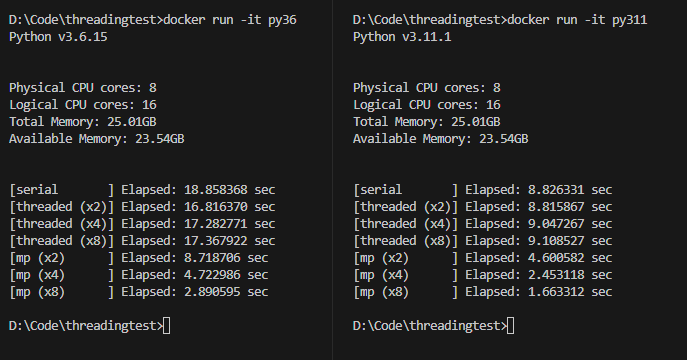

# Threading performance test

## Results

### Python

* AMD Ryzen 7 2700X (8 cores, 16 threads, 3.7 GHz) + 32 GB RAM
    

## Run for yourself

### Python 3.6

```bash
docker build -t py36 -f python/python3.6.Dockerfile .
docker run -it py36
```

### Python 3.11

```bash
docker build -t py311 -f python/python3.11.Dockerfile .
docker run -it py311
```
